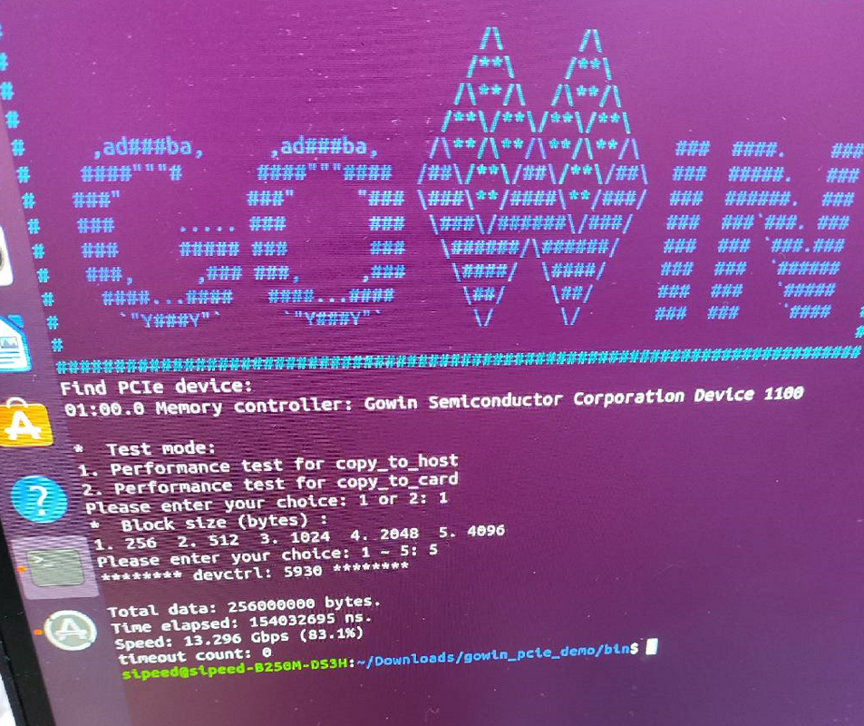

# Tang Mega 138K Pro example

---
板卡介绍: [点我](https://wiki.sipeed.com/hardware/zh/tang/tang-mega-138k/mega-138k.html)
Introduction: [Click me](https://wiki.sipeed.com/hardware/en/tang/tang-mega-138k/mega-138k.html)
---

## Examples

### led

6 Leds with 1 Reset Keys

### key_led

6 Leds with 5 Reset keys.

### ws2812

A demo to drive onboard ws2812, without reset key.

### dvi

2 dvi intefaces both supports video out.

#### svo

Dual Hdmi Display example based on [svo](https://github.com/cliffordwolf/SimpleVOut)

### rgb_screen

Demo to drive RGB Screen.

### dvp_rgb

Demo with OV5640 camera and 480x272 rgb_screen.

### ddr_test

An example to test onboard ddr memory. 
Burn the biststream via GAO and see the result via GAO.

`init_calib_complete` is ddr initialization singal, `one` means initializing success.
`error_int` signal is the ddr check result. `zero` means no error.

### Pcie

Pcie Demo. Read its PDF for more information.

### SFP+

Read [Gowin Customized PHY IP](http://www.gowinsemi.com.cn/enrollment_view.aspx?TypeId=67&Id=942&FId=t27:67:27#IP) For more information.