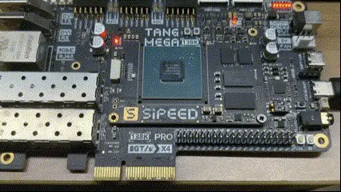
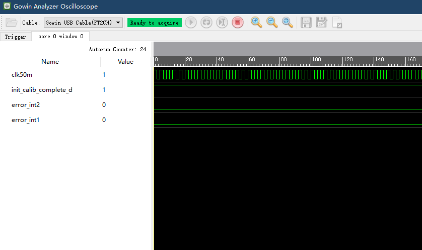

# ddr_test - a DDR3 read & write demo for Sipeed Tang MEGA 138K FPGA Boards

This project is a demo to test the onboard DDR3 memory for GOWIN GW5AST-138K, it base on Sipeed [Tang MEGA 138K Pro](https://wiki.sipeed.com/hardware/en/tang/tang-mega-138k/mega-138k-pro.html), the test results are indicated by 6 LEDs on the Dock board.

# Main features

- Initializes DDR3 and performs read and write verification tests.
- Indication of test status via LED on Dock board.

This demo now is only test on Sipeed [Tang MEGA 138K Pro](https://wiki.sipeed.com/hardware/en/tang/tang-mega-138k/mega-138k-pro.html), which mainchip is **GW5AST-LV138FP676AC1/l0** or **GW5AST-LV138FP676AES**.   

## Directory structure

```
| -- docs                       --> manuals and documentation   
|    |`-- images                --> picture resources  
|    |-- IPUG281-2.2            --> Gowin DDR3 Memory Interface IP User Guide(ZH)
|    |-- IPUG281-2.2E           --> Gowin DDR3 Memory Interface IP User Guide(EN)
|
| -- Hynix_400MHz               --> project for normal retail version
|    |-- src                    --> project sources 
|    |-- impl                   --> project config & implementation 
|    |
|    |`-- ddr3_1v4_hs.fs.7z     --> prbuild bitstream(zipped)                       
|    |`-- ddr3_1v4_hs.gprj      --> demo project
| -- Micron_400MHz              --> project for special customized version
...
...(The following is omitted)

```
⚠️ Note: The retail version of DDR3 models are: **H5TQ4G63EFR-RDC** x2.

## Getting start
Please confirm that you have the following conditions:
- GOWIN IDE Version ≥ **1.9.9**, it is better to be ≥ **1.9.9.03**. For the IDE version used in this demo is **1.9.9.03**.
- **DO NOT** use GOWIN Programmer version **1.9.10.02**, for this version contains many issues with **onboard debugger**.
~~ - You can get a windows GOWIN Programmer version **1.9.10.03** Alpha for [HERE](https://api.dl.sipeed.com/shareURL/TANG/programmer) ~~ GOWIN has released an update version **1.9.10.03**.
- Sipeed [Tang MEGA 138K Pro](https://wiki.sipeed.com/hardware/en/tang/tang-mega-138k/mega-138k-pro.html)
- USB-C date cable, use to connect the board to your PC.

## How to use

Here are quick instructions for the more experienced,
- Connect your board to your PC via an USB-C date cable. 
- Note that the cable must be connected to the USB-C port on the side with the **JTAG|UART** mark.
- Download & Complie the project, then downloading the bitstream to you board.
- You can also try using the prebuilt bitstream, but remember to unzip it before downloading.
- Observe the status of the 6 indicator LEDs.



## LEDs & button

This demo uses 6 LEDs to indicate status 
Here are the details for LEDs:(LED0 is on the far right)
| LEDs      | Description                     | Expected situation|
| ----------| --------------------------------|-------------------|
| LED0      |  DDR3 initialization            | ON                |
| LED1      |  DDR3_pll_lock                  | ON                |
| LED2      |  DDR3_pll_stop                  | ON                |
| LED3      |  No_errors_occurred             | ON                |
| LED4      |  Running_test                   | Blink             |
| LED4      |  DDR3_app_wdf_rdy               | ON                |

1 button **(S0)** use to reset the test.  

## Development

The main purpose of this DEMO is to show how to use the **[GOWIN DDR3 Memory Interface IP](https://www.gowinsemi.com/en/support/ip_detail/14/)** and test the quality of DDR3 hardware. Please refer to the **[manual](./docs/IPUG281-2.2E.pdf)** for details about IP.

You can also enable the GAO in the project, then burn the biststream via GAO and see the result via GAO.


`init_calib_complete` is ddr initialization singal, `one` means initializing success.
`error_int` signal is the ddr check result. `zero` means no error.

Please also see these DEMOs: [cam2hdmi_alt](../cam2hdmi_alt/), [pro_ddr_test](../pro_ddr_test/), They all used DDR3 and demonstrated different uses of DDR3.