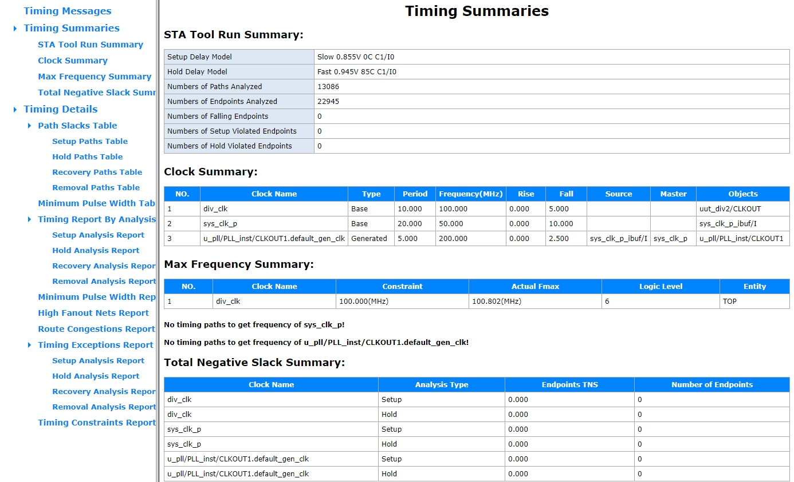
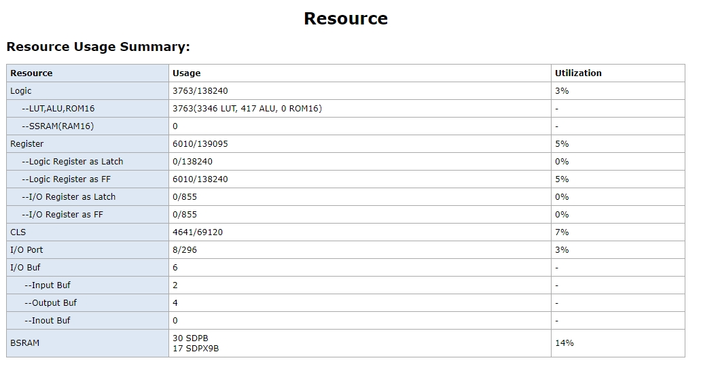
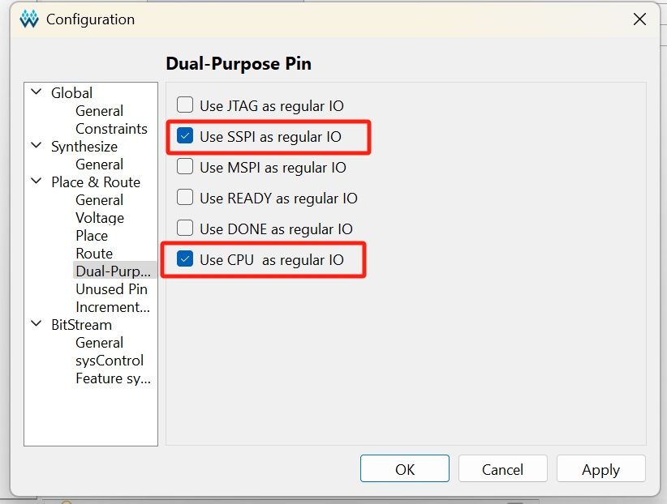
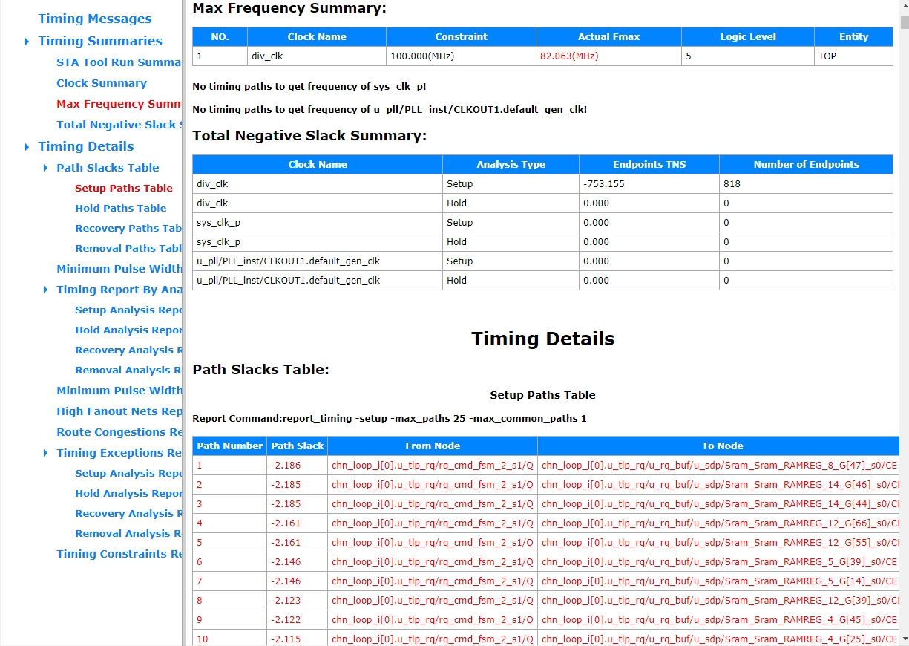

# pcie_dma_demo - a SERDES demo for Sipeed Tang MEGA 138K FPGA Boards


This project is a demo to test the Serdes on GOWIN GW5AST-138K, it base on Sipeed [Tang MEGA 138K Pro](https://wiki.sipeed.com/hardware/en/tang/tang-mega-138k/mega-138k-pro.html), and uses the PCIe x4 **AIC interfaces** on the board for transceiver testing.

## Main features

- x1, x2 or x4 PCIe bus transmission
- Support both PCIe Gen2 or Gen3
- Speed testing with **GOWIN** Linux PCIe Driver and Demo Application
- Up to 6 configurable PCIe bar

This demo is the pcie demo of Sipeed [Tang MEGA 138K Pro](https://wiki.sipeed.com/hardware/en/tang/tang-mega-138k/mega-138k-pro.html), which mainchip is **GW5AST-LV138FPG676AC1/10** or **GW5AST-LV138FPG676AES**.   
For Sipeed [Tang MEGA 138K](https://wiki.sipeed.com/hardware/en/tang/tang-mega-138k/mega-138k.html), which mainchip is **GW5AST-LV138PGG484AC1/10** or **GW5AST-LV138PG484AES**. [Click Here](https://github.com/sipeed/TangMega-138K-example/tree/main/pcie_dma_demo).  

For Sipeed [Tang MEGA 60k](https://wiki.sipeed.com/hardware/en/tang/tang-mega-60k/mega-60k.html), which mainchip is **GW5AT-LV60PGG484AC1/10** or **GW5AT-LV60PG484AES**. [Click Here](https://github.com/sipeed/TangMega-60K-example/tree/main/pcie_dma_demo).


## Directory structure

```
| -- docs                         --> manuals and documentation
|    |`-- PCIe_demo_guide_en.pdf  --> official guide（en） 
|    |`-- PCIe_demo_guide_zh.pdf  --> official guide(zh) 
|     `-- images                  --> picture resources
|    
| -- pcie_gen2(5G)                --> pcie_gen2 demo 
|    |
|    |`-- pcie_dma_demo_5g.fs.7z  --> prbuild bitstream(zipped)
|     `-- pcie_dma_demo_5g.gar    --> demo project archived
|    
| -- pcie_gen3(8G)                --> pcie_gen3 demo 
|    |
|    |`-- pcie_dma_demo_8g.fs.7z  --> prbuild bitstream(zipped)
|     `-- pcie_dma_demo_8g.gar    --> demo project archived
|    ...
|
| -- gowin_pcie_demo.7z           --> drivers & app for test(zipped)    
|   
```

***
## Implementation report

### Timing report

As shown, the design meets all timing constraints.

### Resource report

The resource usage of this design is shown in the figure aboce.

***

## Getting start

- See official guide first.
- GOWIN IDE Version: **1.9.11.01**.
- Please **DO NOT** :
   - Delete the **`impl`** folder.
   - Try to change the FPGA model in the project yourself.
   - Rename the project. 
   
   Otherwise you may lose important configuration information about your project. This leads to a series of problems such as implementation failure or unsatisfied timing.

   If you unfortunately have encountered a problem, please refer to the [Troubleshoot](#troubleshoot) section for solutions.


## Important notes

   - You need to compile the kernel module and the demo app for your system and load the kernel module yourself.
   - The recommended operating system distribution is **Ubuntu 20.04 & 22.04**, but **Ubuntu 24.04** or newer is also available (you need to solve the dependency problem by yourself). 
   - It's recommend to programming your board to flash before start test.
   - If you want to compile the demo yourself, don't forget to set the flash loading rate to 105MHz in *Project-Configuration-sysControl*. Otherwise, there will be some compatibility issues when using PCie on the computer motherboard for testing.

## How to use

- See GOWIN [official guide](./docs/) first.
- Prepare the system and environment for testing and ensure that the kernel module is loaded correctly.
- Assemble your board with a PC motherboard with PCIe Slot(x4 or longer), or use a USB4/Thunderbolt PCIe dock instead.
- Use the `lspci` to check whether there is a new `**memory controller**` in the system, and its ID is `22C2:1100`.Otherwise, please troubleshoot the problem according to the LED table below.
- Starting test according to the instructions in the [official guide](./docs/PCIe_demo_guide_en.pdf).

## LEDs & button

This demo uses 4 LEDs to indicate status
Here are the details for LEDs: 
(LED0 is on the far right, next to the HDMI connector)

| LEDs      | Description                     | Expected situation|
| ----------| --------------------------------|-------------------|
| LED0      |  RUNNING INDICATOR              | BLINK             |
| LED1      |  PCIe RESET                     | *OFF(SEE NOTE)    |
| LED2      |  PCIe LOGIC START               | ON                |
| LED3      |  PCIe LINK UP                   | ON                |

*NOTE: During the computer startup self-test or after plug USB4/Thunderbolt cable to the computer, the LED will light up briefly. 
But this LED should not be always on, otherwise please check whether the relevant **PIN(L23)** in the project is constrained to **PULL_UP** mode.

1 button **S0(K16)** use to reset the transmission.  

## Troubleshoot

### Building the progject
- **WARN  (PR1014) :** Generic routing resource will be used to clock signal 'sys_clk_p_d' by the specified constraint.
  - This is due to the oscillator clock input pin **`P16`** on the SOM which is not the GCLK pin.
  - Since this design does not involve complex cross-clock domain synchronization processing, it can be ignored.

- **ERROR  (PR2028) :** The constrained location is useless in current package. 
- **ERROR  (PR2017) :** 'led[x]' cannot be placed according to constraint, for the location is a dedicated pin (CPU/SSPI).
  - This is usually caused by missing project configuration. As the error message says, led[x] is a dedicated pin **`(CPU/SSPI)`**.
  - The solution is as follows:
    - In top bar menu, go to ***`Project-Configuration`***, than selet ***`Dual-Purpose Pin`***. Check the corresponding options according to the error message. 
    - For example, you need to check ***`Use SSPI as regular IO` & `Use CPU as regular IO`*** here.
    
    - Then try to re-Implementation it.
- The timing report shows that timing constraints are not met (contains **RED ITEMS**)

  - This is also caused by missing project configuration. In order to solve the problem, you need to confirm the following settings:
     - In top bar menu, go to ***`Project-Configuration`***, than selet ***`Place`***. Change the `Place Option` to `2`. 
     - *(optional)* Change `Place input registers to IOB`, `Place output registers to IOB`, `Place inout registers to IOB` to `Ture`.
     - *(optional)* In ***`Route`*** page, Change the `Clock Route Order` to `1` & `Route Option` to `1`.
     - Then try to re-Implementation it.

### Testing the borad
#### On PC motherboard:
- Please ensure that the board is programmed while the host computer is completely powered off, and then powered on your computer.
- If you find that the FPGA board is not recognized after entering the system, you need to reboot, or perform the above process again.

#### On USB4/Thunderbolt dock:
- Please ensure that the board is programmed, then plug it into your dock, the dock need to power-off first.
- Makesure that the dock is properly connected to power (if needed), then connect the dock to your PC. If you find that the FPGA board is not recognized, just re-plug your dock.
- If your dock cannot provide 12V power supply or does not have PCIe 3V3, you can use additional USB to power the FPGA board.

#### On Raspberry Pi:
- CM4/5 or RPi 5 is needed.
- Currently, there are compatibility issues between GOWIN's PCIe hardcore and ARM's PCIe controller. An additional retimer (such as DS80PCI402) or switch (such as ASM2806 or ASM1884e) is required to be recognized by the arm host.

## Test environment
These environments have been verified and the demo can be used normally.

**On PC motherboard:**
- Motherboard: GIGABYTE **B365 M AORUS ELITE**
- CPU: Genuine Intel **i5-8400**
- System: Ubuntu **22.04** (Secure Boot disabled)

  Note: On this motherboard, if the demo is in **Gen3** mode, `copy_to_host` seems to have some problems, especially when the block size is **4096**. 
  
  The test will take a long time and look like it is frozen.Perhaps if you wait patiently for a while, the results will come out.
***
**On USB4/Thunderbolt dock:**
- Barebone computer: Genuine Intel **NUC13ANHi7**
- System: Ubuntu **22.04** (Secure Boot disabled)
- PCIe dock: **ADT UT3G** (ASM2464)
  
  Note: This dock seems to be **Unstable** with PCIe Gen2. During my testing, the dock did somtimes not recognize the Gen2 mode demo. 
  
  Perhaps the **JHL** series(JHL7/8xxx) is more suitable for this test?
***
**On Raspberry Pi:**
- Raspberry Pi 5b(2GB RAM).
- **WaveShare** PCIe TO PCIe x1 Board (C).
- **WaveShare** PCIe-Packet-Switch-4P (ASM1184e). 
- Necessary FPC wires and copper pillars.


## Development

Please refer to the comments in the top file, those comments help understand how the entire demo works.

The brief working principle of the demo:
1. Analyze the tlp written to the BAR to obtain the dma configuration.
2. Then the fpga starts the dma to send the tlp for memory reading and writing, and at the same time reports the interrupt through the MSI.


