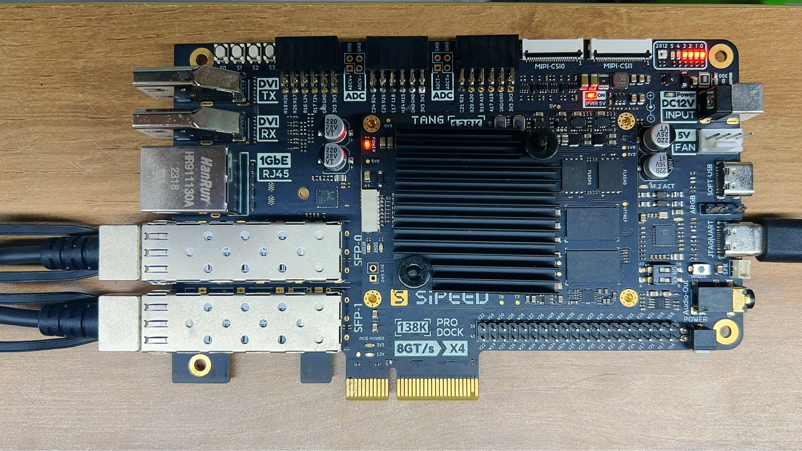
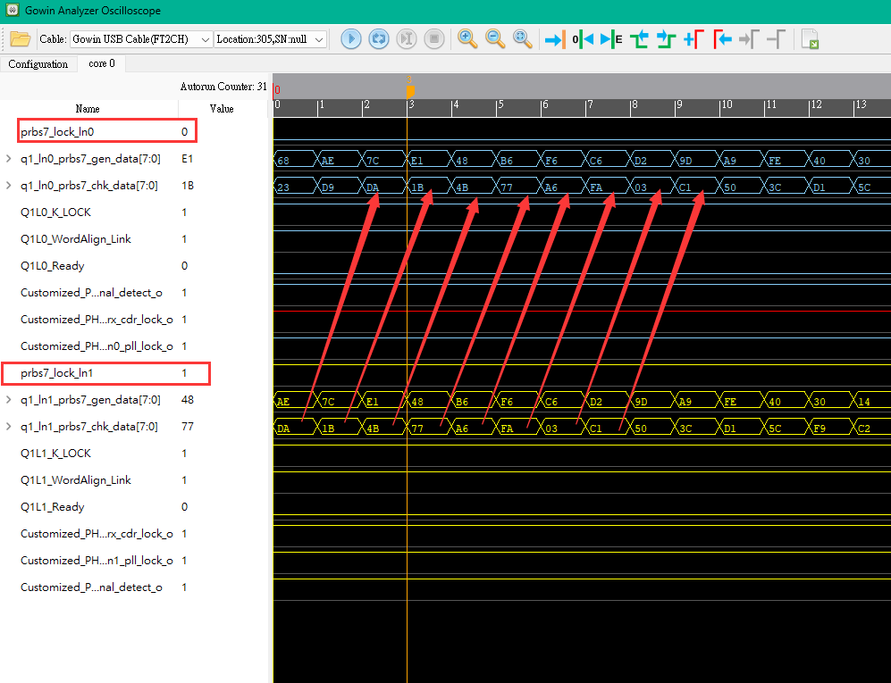

# customized_phy - a SERDES demo for Sipeed Tang MEGA 138K Pro FPGA Boards


This project is a demo to test the Serdes on GOWIN GW5AST-138K, it base on Sipeed [Tang MEGA 138K Pro](https://wiki.sipeed.com/hardware/en/tang/tang-mega-138k/mega-138k-pro.html), and uses the 2 SFP+ interfaces on the board for transceiver testing.

Main features,

- 1.25Gbps to 12.5Gbps transmission
- 8B/10B encoding with comma align(Except for the case of 1.25Gbps)
- PRBS7 sequence to check data integrity

This demo now is only test on Sipeed [Tang MEGA 138K Pro](https://wiki.sipeed.com/hardware/en/tang/tang-mega-138k/mega-138k-pro.html), which mainchip is **GW5AST-LV138FPG676AC1/10** or **GW5AST-LV138FPG676AES**.   

In theory, other GW5AST & GW5AT models can also use this demo, but the maximum speed of Serdes with ***non-Flip Chip BGA*** packaged FPGA chips (such as **GW5AST-LV138PG484A**) may not reach 12.5Gbps.

## Directory structure

```
| -- docs  
|    `-- images					          --> picture resources  
| -- customized_phy
|    |-- 1.25G                            
|        |	`-- fpga_project.gprj		  --> demo project
|        |	`-- fpga_project.gprj.user	  --> project conf.
|        |-- src
|          |  `-- top.v		              --> top_module file
|          |  `-- fpga_project.cst        --> physical constraints file
|          |  `-- fpga_project.rao        --> RAO profile
|          |  `-- fpga_project.sdc        --> timing constraints file
|          |  `-- serdes                  --> serdes ip foldr
|          |  `-- prbs7_chk.v             --> prbs7 checker
|          |  `-- prbs7_gen.v             --> prbs7 generator
|          |  `-- prbs7_single_channel.v  --> prbs7 tester
|    |-- 10.3125G
|        |	`-- fpga_project.gprj		  --> demo project
|        |	`-- ...
|    |-- 12.5G
|        |	`-- fpga_project.gprj		  --> demo project
|        |	`-- ...
| -- 10G_Serial_Ethernet 
|    `-- ...					          --> TBD        
```
## Getting start

Please confirm that you have the following conditions:
- GOWIN IDE Version ≥ 1.9.10
- Sipeed [Tang MEGA 138K Pro](https://wiki.sipeed.com/hardware/en/tang/tang-mega-138k/mega-138k-pro.html)
- 2 SFP+ modules & fiber, or SFP+ **DAC/AOC** cable (10G or higher)
- USB-C date cable, use to connect the board to  PC  

NOTE: If you suspect that powering via USB-C alone is not enough, maybe an additional 12V DC adapter is useful.

## How to use

Here are quick instructions for the more experienced,
- Plug SFP+ module into SFP+ cage，and connect fiber as AB|BA, or plug your DAC cable into both SFP+ cages



- Download & Complie the project, then use the GAO(Gowin Analyzer Oscilloscope) in the GOWIN IDE to capture data



Generally, you can see in GAO that the two sets of sent and received data are cross-corresponding.  
A [step-by-step instructions](https://wiki.sipeed.com/hardware/en/tang/Tang-Nano-Doc/GAO.html) will available on sipeed wiki later.

## LEDs & button

This demo uses 4 LEDs to indicate status  
Here are the details for LEDs:
| LEDs      | Description                    | Expected situation|
| ----------| -------------------------------|-------------------|
| LED0      |  lane0 prbs7 check successfully| ON                |
| LED1      |  lane1 prbs7 check successfully| ON                |
| LED2      |  lane0 TX clock is runing      | Blink             |
| LED3      |  lane1 TX clock is runing      | Blink             |

1 button **(S0)** use to reset the transmission.  

## Development

If you want to modify the transfer rate of the project, you may need to you may need [to modify the configuration of exPLLs](../docs/SET_5351.md).  

