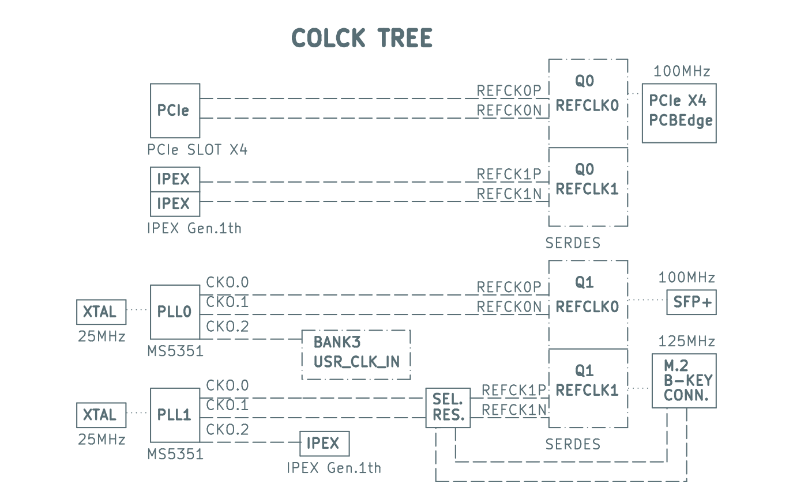
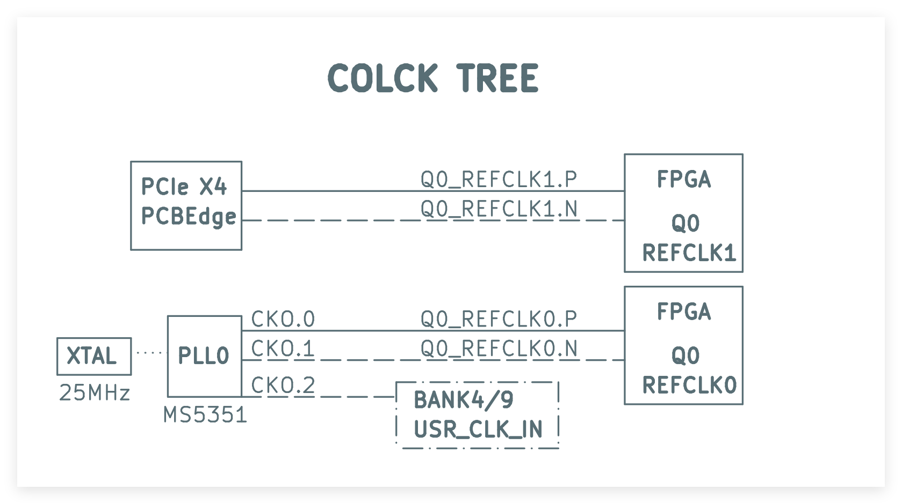
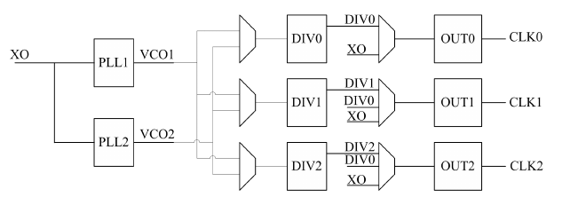

# exPLL Configuration Instructions
Here is the clock tree of [Tang MEGA 138K Pro](https://wiki.sipeed.com/hardware/en/tang/tang-mega-138k/mega-138k-pro.html):

 

> For [Tang MEGA 138K](https://wiki.sipeed.com/hardware/en/tang/tang-mega-138k/mega-138k.html) & [Tang MEGA 60K](https://wiki.sipeed.com/hardware/en/tang/tang-mega-138k/mega-60k.html), there is only **ONE** ms5351 on the board.

  


And this is the internal structure of MS5351

  

Where DIVx = 8~1800

## Manual modification

To modify the configuration of exPLLs, follow these steps:
1. Open the ***larger*** one of the two serial ports provided by the onboard debugger via **Putty** or **minicom** or anything you like
    - For windows users, if you get **COM3 & 4**. Usually it should be **COM4**
    - For linux/macOS users, if you get **USBtty0 & 1**. Usually it should be **USBtty1**
2. Press `Ctrl + x`, `Ctrl + c`, and `Enter` in sequence. Enter the PLL configuration console
3. Try the code below to complete the modification
```
## Switch the PLL to be modified
    pll_switch <0,1> //Only for 138K Pro dock

## Save the current configuration
    pll_clk -s
   
## Set differential output CLK0 CLK1
100M       pll P0:36 D0@P0:9 D1@P0:9 O0@D0:0,0 O1@D0:0,1
125M       pll P0:30 D0@P0:6 D1@P0:6 O0@D0:0,0 O1@D0:0,1
156.25M    pll P0:25 D0@P0:4 D1@P0:4 O0@D0:0,0 O1@D0:0,1

## Set single-ended output CLK2
100M       pll_clk O2=100M
16M        pll_clk O2=16M
500K       pll_clk O2=500K
xxx        pll_clk O2=xxx

## Set single-ended output CLK2 (High Precision)
100M       pll P1:36 D2@P1:9 O2@D2:0
25M        pll P1:36 D2@P1:9 O2@D2:2
1M         pll P1:32 D2@P1:25 O2@D2:5
...

Calculation method:
(25M) x (Px) / (Dx) / (2^Ox)
```
## Modify using Python
See [ms5351.py](python/ms5351.py) and [ms5351_dis.py](python/ms5351_dis.py) for refer.

## Hardware documents
Visit Sipeed [Download Station](https://dl.sipeed.com/shareURL/TANG) for more detail.
