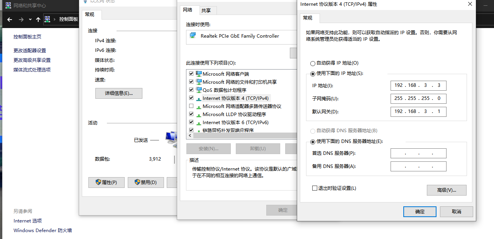
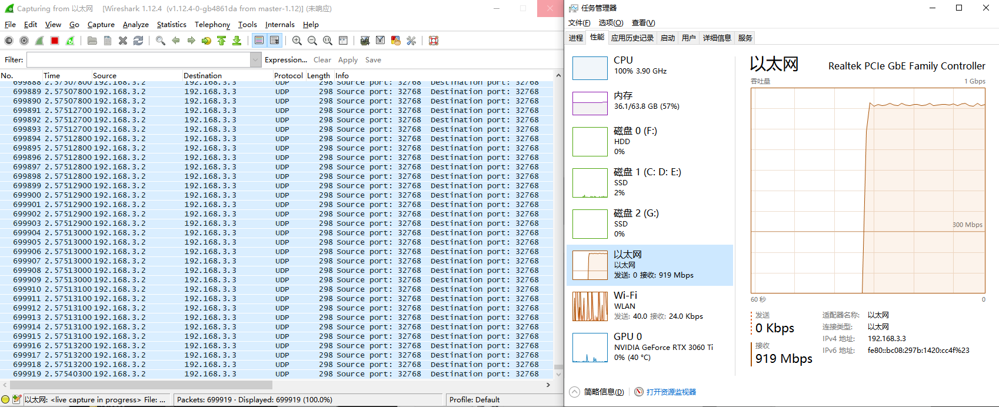

# 实现环境

1、138K PRO DOCK 开发板

2、CAT-5E以上网线一根

3、带1000M网口的PC

4、wireshark网口检测软件

# 工程描述

本工程为一个基于RGMII的简单测试发送带宽例程，通过基本的GMII发送模块生成固定的数据包，再通过ODDR转为RGMII时序发送到RTL8211F传到PC端。

其中为方便测试，电脑通常需要关闭防火墙，IP设置如下

# 下载现象

1、下载后网口黄灯闪烁

2、打开任务管理器可观察到新增以太网端口

3、打开wireshark，检测开发板所属以太网端口，即可捕捉数据，同时任务管理器显示900+M接收带宽，此时wireshark处于半卡死状态（数据太多了），如需调试，请尝试降低通信速率。

# 版本更新

20231011: 初始版本。已知问题：1、发送数据状态机需多计一个 2、FMAX不满足 3、需开启软件端口才可观察到1000M带宽

