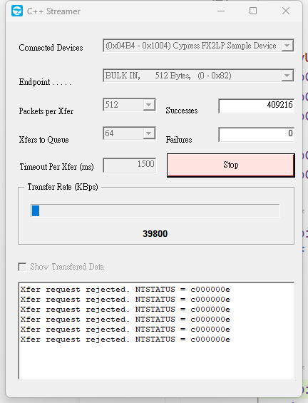

# USB2_Soft - A series about USB2 soft_PHY demo for Sipeed Tang MEGA 138K FPGA Boards

This directory is a series demo to test the **USB2** `soft_PHY` & `device_controller` on GOWIN GW5AST-138K, it base on Sipeed [Tang MEGA 138K Pro](https://wiki.sipeed.com/hardware/en/tang/tang-mega-138k/mega-138k-pro.html), it uses the USB-C port marked with **SOFT-USB** to connect to PC. Users could realize custom USB devices with ether **high-speed(480Mbps)** or **full-speed(12Mbps)** by develop with these example.

***

# Main features

- Solution without any chip, only need **RC network** & **9 FPGA pins**.
- Provides a custom USB2 controller, both **high-speed(480Mbps)** or **full-speed(12Mbps)**.
- Up to 16 custom IN/OUT USB EndPoints.
- Transfer rate up to 39.8MB/s(318.4Mbps).


<div style="display: flex; flex-direction: column;"> 
  <div style="display: flex; justify-content: space-around; gap: 10px; width: 100%;">
    
    
  </div> 
    <div style="margin-top: 10px; text-align: left;"> Speed test with <b>Cypress C++ Streamer</b>(Need to install <b>Cypress</b> proprietary driver)</div> 
  </div>

  ***

  This demo now is only test on Sipeed [Tang MEGA 138K Pro](https://wiki.sipeed.com/hardware/en/tang/tang-mega-138k/mega-138k-pro.html), which mainchip is **GW5AST-LV138FP676AC1/l0** or **GW5AST-LV138FP676AES**.  

***

## Directory structure

```
| -- docs                             --> manuals and documentation   
|    |`-- images                      --> picture resources  
|    |`-- manuals                     --> official manual from GOWIN
|
| -- usb_uart_loopback                --> project for usb to uart loopback
|    |-- src                          --> project sources 
|    |-- impl                         --> project config & implementation 
|    |
|    |`-- usb_uart_loopback.fs.7z     --> prbuild bitstream(zipped)                       
|    |`-- usb_uart_loopback.gprj      --> demo project
| -- usb_cy_streamer                  --> project for speedtest(Cypress FX2 driver)
...
...(The following is omitted)

```
⚠️ Note: Please refer to the relevant documents for the use of Cypress C++ streamer. Related programs and drivers are not provided here.

## How to use

See the corresponding project's readme for details
- [usb_uart_loopback](./usb_uart_loopback/readme.md)
- [usb_cy_streamer](./usb_cy_streamer/readme.md)
- [cy_usb_bulkloop](./usb_cy_bulkloop/readme.md)

***

## Troubleshoot

If you encounter any problems, please submit an issue to this repository.
