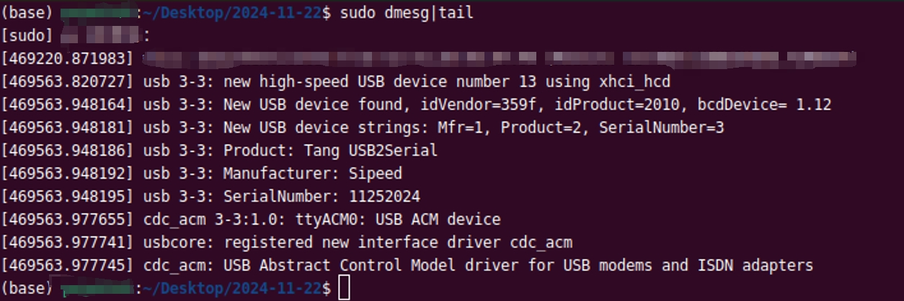
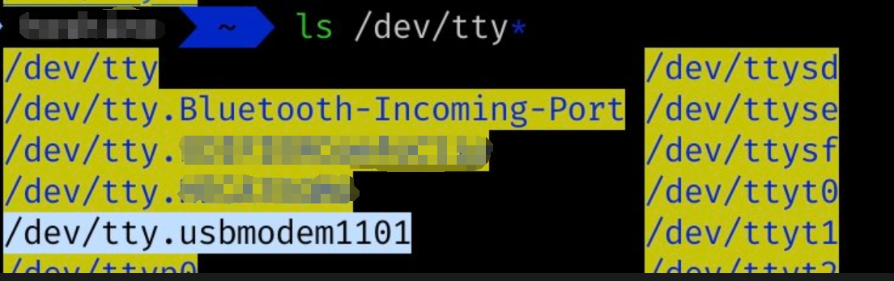
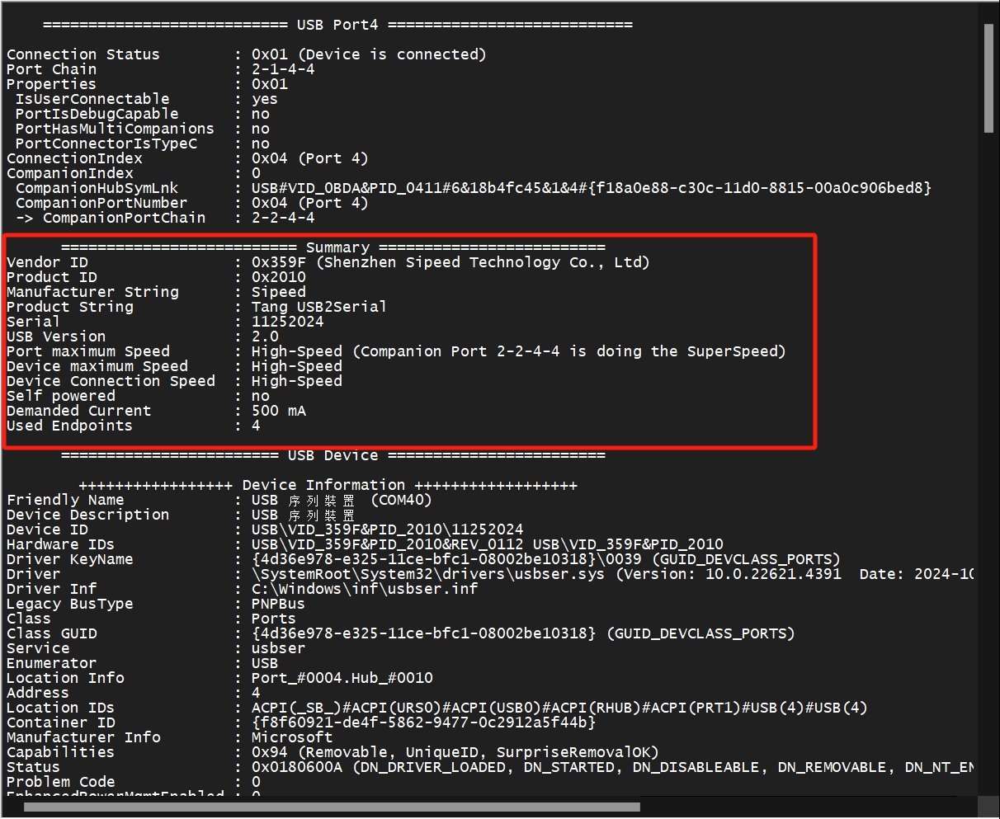
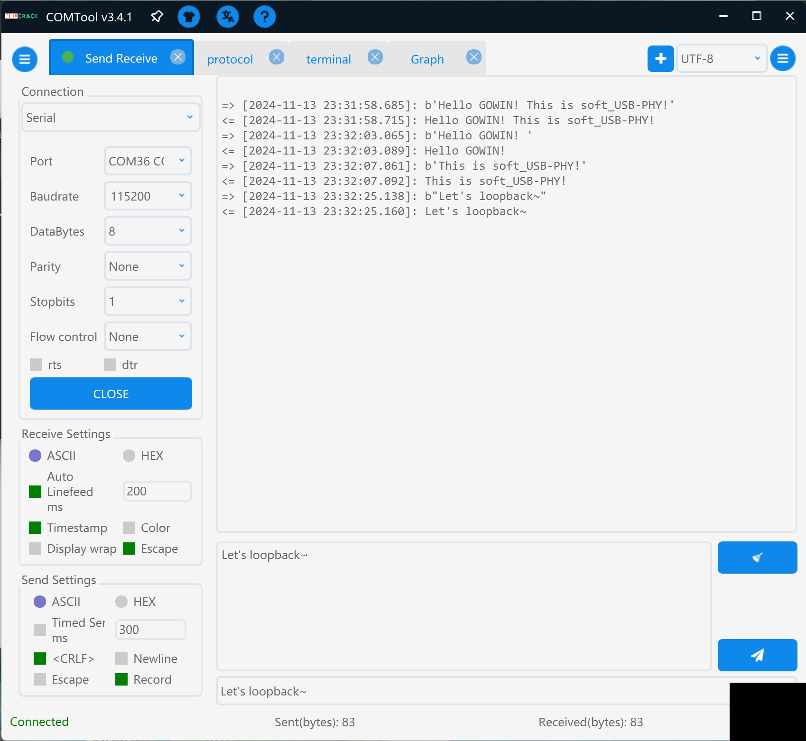
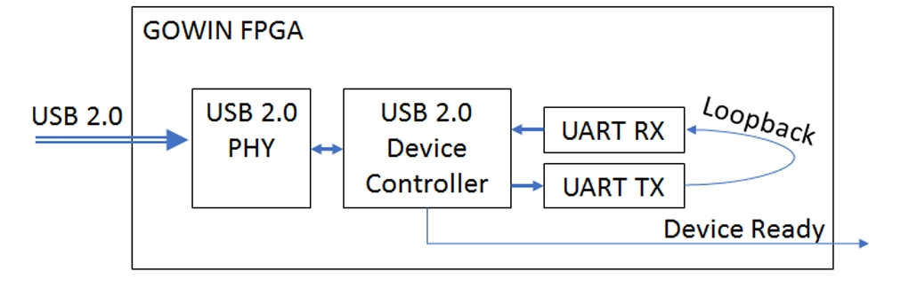

# usb_uart_loopback
This directory is a demo of USB-Serial loopbadk devices on Sipeed [Tang MEGA 138K Pro](https://wiki.sipeed.com/hardware/en/tang/tang-mega-138k/mega-138k-pro.html).

***

## Main features
- **Baudrate**: Fixed to `115200`, maybe variable baudrate will be updated in the future.
- Standard `CDC-ACM` device, which can be plug and play without installing drivers.
- Automatic loopback: what you send will be what you receive.

***

## System compatibility

Compatibility testing only means testing on the following systems, so the notes are only theoretical.
| System                   | Compatibility   | Notes                                     |
| -------------------------|-----------------|-------------------------------------------|
| **Windows** (11)         |  ✔             | Requires Windows 10 or higher             |
| **Linux** (Ubuntu 22.04) |  ✔             | Requires kernel version above 2.4.0       |
| **macOS** (Sequoia 15.0) |  ✔             | Requires macOS version 10.11 or higher    |

***

## Getting start
Please confirm that you have the following conditions:
- GOWIN IDE Version ≥ **1.9.9**, it is better to be ≥ **1.9.9.03**. For the IDE version used in this demo is **1.9.9.03**.
- **DO NOT** use GOWIN Programmer version **1.9.10.02**, for this version contains many issues with **onboard debugger**.

    GOWIN has released an update version **1.9.10.03**.
- Sipeed [Tang MEGA 138K Pro](https://wiki.sipeed.com/hardware/en/tang/tang-mega-138k/mega-138k-pro.html)
- 2 USB-C date cable, use to connect the board to your PC.

***

## How to use

Here are quick instructions for the more experienced,
- Connect your board to your PC via an USB-C date cable. 
- Note that the cable must be connected to the USB-C port on the side with the **`JTAG|UART`** mark.
- Download & Complie the project, then downloading the bitstream to you board.
- You can also try using the prebuilt bitstream, but remember to unzip it before downloading.
- Then plug another USB-C cable to the USB-C port with the **`SOFT_USB`** mark.
- Observe the status of the 6 indicator LEDs.
- Running UART loopbak test on you PC.

***

### Demonstration of demo USB device

- What you can see in **Windows Device Manager**

    
    
    **`COM40` is the target device, Windows 10 and above do not require additional drivers.**

- What you can see in **Linux dmesg**

    
    
    **`ttyACM0` is the target device, Linux kernel above 2.4.0 do not require additional drivers.**

- What you can see in **macOS /dev/tty.usbmodem\***

    

    **`tty.usbmodem1101` is the target device, macOS 10.11 and above do not require additional drivers**

- What you can see in **USB Tree View**

    
    
    **As you can see, this is a high-speed USB device**

- UART loopback test with **[COMToool](https://github.com/neutree/COMTool)**

    

    **Open COM40 in COMTool, set baudrate to **`115200`**, than send anything you want**

- How it works

    

    **This is just a simple schematic, please refer to the LEDs description below**

## LEDs

This demo uses 6 LEDs to indicate status 
Here are the details for LEDs: (LED0 is on the far right)
| LEDs      | Description                     | Expected situation|
| ----------| --------------------------------|-------------------|
| LED0      |  Running indicator              | Blink             |
| LED1      |  Main PLL Locked                | ON                |
| LED2      |  System reset inactive          | ON                |
| LED[3..4] |  USB PHY Mode indicator         | ALL ON            |
| LED5      |  Device Controller ready*       | ON                |

\*Note: `LED5` is controlled by **USB Device Controller**. In this demo, the **USB Device controller** is fixed in **High-Speed** mode. 

Here are the details for LED[3..4]: (1 means the LED is on)
| LED[3..4] | Description                     | Note                  |
| ----------| --------------------------------|-----------------------|
| [1, 1]    |  `High-Speed` mode              | Normal State          |
| [0, 1]    |  `Full-Speed` mode              | USB connection error* |
| [1, 0]    |  `Low-Speed` mode               | unkown state**        |
| [0, 0]    |  **X**                          | unkown state**        |

 - \*Note: If `LED5` is **ON** and `LED3` and `LED4` are not **ALL ON**, it means something went wrong with the test. You need to re-plug the USB cable and re-test. 

    - Falling back to FS mode is most likely due to poor USB connection quality, Please try changing to a better quality, shorter USB cable.

    - Since the demo does not do **ANY** `Low-speed` related logic, if the LED indicates that it is now in `LS mode`, there must be a big problem with the FPGA.  

 - \*\*Note: `LED[3:4]` **ALL ON** when **USB PHY** is in `High-Speed` mode.

***

## Future plans

- [ ] Supports variable baudrate
- [ ] Supports UART PIN connection to physical interface

...

***

## Development

Please refer to the relevant comments in the TOP file, which will be beneficial to secondary development and understanding of this demo.

The main purpose of this DEMO is to show how to use the **[GOWIN USB 2.0 SoftPHY IP](https://www.gowinsemi.com/en/support/ip_detail/98/)** and the **[GOWIN USB 2.0 Device Controller IP](https://www.gowinsemi.com/en/support/ip_detail/91/)**. Please refer to the **[manuals](../docs/manuals/)** for details about IP.

You can also enable the GAO in the project, then burn the biststream via GAO and see the result via GAO.

Here is a [step-by-step instructions](../../sfp+/docs/manual/SUG114-3.0E_Gowin%20Analyzer_Oscilloscope_User_Guide.pdf) for how to use the GAO.

If you encounter any problems, please submit an issue to this repository.
