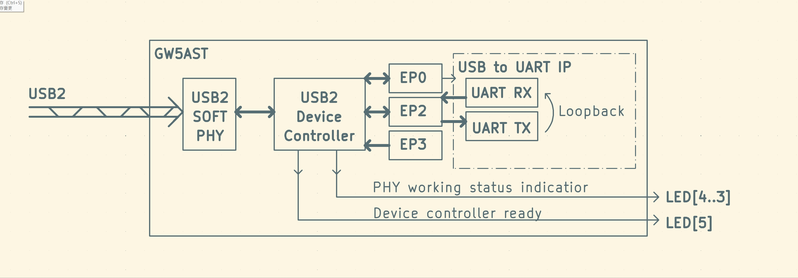

# usb_uart_loopback
This directory is a demo of USB-Serial loopbadk devices on Sipeed [Tang MEGA 138K Pro](https://wiki.sipeed.com/hardware/en/tang/tang-mega-138k/mega-138k-pro.html).

***

## Main features
- **Baudrate**: Fixed to `115200`, maybe variable baudrate will be updated in the future.
- Standard `CDC-ACM` device, which can be plug and play without installing drivers.
- Automatic loopback: what you send will be what you receive.

***

## Getting start
Please confirm that you have the following conditions:
- GOWIN IDE Version ≥ **1.9.9**, it is better to be ≥ **1.9.9.03**. For the IDE version used in this demo is **1.9.9.03**.
- **DO NOT** use GOWIN Programmer version **1.9.10.02**, for this version contains many issues with **onboard debugger**.
~~ - You can get a windows GOWIN Programmer version **1.9.10.03** Alpha for [HERE](https://api.dl.sipeed.com/shareURL/TANG/programmer) ~~ GOWIN has released an update version **1.9.10.03**.
- Sipeed [Tang MEGA 138K Pro](https://wiki.sipeed.com/hardware/en/tang/tang-mega-138k/mega-138k-pro.html)
- 2 USB-C date cable, use to connect the board to your PC.

***

## How to use

Here are quick instructions for the more experienced,
- Connect your board to your PC via an USB-C date cable. 
- Note that the cable must be connected to the USB-C port on the side with the **JTAG|UART** mark.
- Download & Complie the project, then downloading the bitstream to you board.
- You can also try using the prebuilt bitstream, but remember to unzip it before downloading.
- Then plug another USB-C cable to the USB-C port with the **SOFT_USB** mark.
- Observe the status of the 6 indicator LEDs.
- Running UART loopbak test on you PC.

***

### Demonstration of demo USB device

- What you can see in **Windows Device Manager**

**COM36 is the target device, Windows 10 and above do not require driver installation**

- What you can see in **USB Tree View**

**As you can see, this is a high-speed USB device**

- UART loopback test in **[COMToool](https://github.com/neutree/COMTool)**

**Open COM36 in COMTool, set baudrate to 115200,than send anything you want**

- How it works

**This is just a simple schematic, please refer to the LEDs description below**

## LEDs

This demo uses 6 LEDs to indicate status 
Here are the details for LEDs:(LED0 is on the far right)
| LEDs      | Description                     | Expected situation|
| ----------| --------------------------------|-------------------|
| LED0      |  Running indicator              | Blink             |
| LED1      |  Main PLL Locked                | ON                |
| LED2      |  System reset enabled           | OFF               |
| LED3      |  PHY is FS Mode*                | OFF               |
| LED4      |  PHY is LS Mode*                | OFF               |
| LED5      |  Device is High-Speed**         | ON                |

 \* Note: `LED[3:4]` **ALL OFF** when **USB PHY** is in HS mode.

\*\*Note: `LED5` is controlled by **USB Controller**. In this demo, the **USB controller** is fixed in **High-Speed** mode. If `LED5` is **ON** and `LED3` and `LED4` are not **ALL OFF**, it means something went wrong with the test. You need to re-plug the USB cable and re-test. 

**

## Development
The main purpose of this DEMO is to show how to use the **[GOWIN USB 2.0 SoftPHY IP](https://www.gowinsemi.com/en/support/ip_detail/98/)** and the **[GOWIN USB 2.0 Device Controller IP](https://www.gowinsemi.com/en/support/ip_detail/91/)**. Please refer to the **[manuals](../docs/manuals/)** for details about IP.

You can also enable the GAO in the project, then burn the biststream via GAO and see the result via GAO.

Here is a [step-by-step instructions](../../sfp+/docs/manual/SUG114-3.0E_Gowin%20Analyzer_Oscilloscope_User_Guide.pdf) for how to use the GAO.

If you encounter any problems, please submit an issue to this repository.
